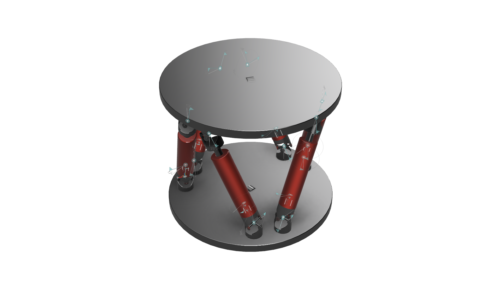

# 6-6 Stewart Platform Inverse Kinematic

Six legs join the base to the platform in the simplest form of Stewart Platform. They are set up in three sets of two, linked together by universal joints, and controlled in a linear fashion. In this context, "anchors" refer to the points at which the legs are attached to the foundation and the platforms.

## Base and Platform Anchors

Standard notation for the fundamental parameters that determine the mechanical configuration is

- $r_B\to$ Radius of Base (Bottom)

- $r_P\to$ Radius of Platform (Top)

- $\gamma_B\to$ Half of angle between two anchors on the base

- $\gamma_P\to$ Half of angle between two anchors on the platform

We may define $\psi_B \in R^{6 \times 1}$ & $\psi_P\in R^{6 \times 1}$ and the polar coordinates of the anchors on a unit circle radius using these $\gamma_B$ &  $\gamma_P$. These are derived from the gamma values of $B$ and $P$.

If we have $r_B$ and $r_P$, then we may define as the coordinates of the anchors in their respective local frames in cartesian space, which are $B \in R^{6 \times 3}$ and $P\in R^{6 \times 3}$. For instance, an illustration of the anchor points on the base B may be found below.

## Positioning Oneself at Home

The gap between the base and the platform at the starting point,, must then be specified. Your resting linear actuator length is. Let's say it's the base plate radius.

Using the usual notation, we must additionally define the rotation matrices.

$$ R_z{(\theta)}=
   \begin{bmatrix} 
   \cos{\theta} & -\sin{\theta} & 0 \\
   \sin{\theta} & \cos{\theta} & 0 \\
   0 & 0 & 1 \\
   \end{bmatrix} $$
   
$$ R_y{(\theta)}=
  \begin{bmatrix} 
  \cos{\theta} & 0 & \sin{\theta} \\
  0 & 1 & 0 \\
  -\sin{\theta} & 0 & \cos{\theta} \\
  \end{bmatrix} $$

$$ R_x{(\theta)}=
  \begin{bmatrix} 
  1 & 0 & 0 \\
  0 & \cos{\theta} & -\sin{\theta} \\
  0 & \sin{\theta} & \cos{\theta} \\
  \end{bmatrix} $$

## Using Linear Actuators to Determine Inverse Kinematics

We may now begin working on the inverse kinematics problem.

Using the target translation vectors $T = (t_x,t_y,t_z)^T$ and the rotation vector $\theta = (\theta_x, \theta_y, \theta_z)^T$, determine the required leg length.

After the plate has been rotated and translated as desired, all that remains is to determine the new locations of the various anchors.

Given that each leg's job is to establish a connection between the base and the platform's anchor, the required vector (direction and length) for each leg is simply the leg's location in 3D space with respect to its corresponding base anchor.
$$l = T+H+p+R(\theta)-B$$
Where, $T$ and $H$ are in $R^{3 \times 1}$ replicated 6 times to have dimensions $R^{3 \times 6}$ to facilitate matrix calculations.

It's possible to interpret this as,

$$l = Desired~~Translation+displacement(Base~~Center,Home~~Pos) + Coordinate~~Rotation(globalframe)$$

A leg's length is simply the leg vector's magnitude.
$$|l| = (l_{k,x}^2+l_{k,y}^2+l_{k,z}^2)^{0.5}$$

Simply adding the displacement of each leg's anchor at the ground yields the leg's position relative to the global frame's centre of base.

And that's only to figure out the inverse kinematics of linear actuator-driven Stewart platforms.
